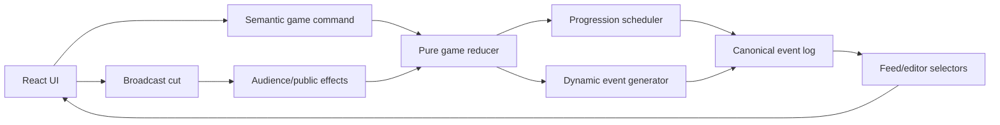

# Dynamic Event Engine Implementation Plan

The safest implementation path is incremental: preserve the current playable UI, build a deterministic simulation underneath it, then replace the fixed feed, editor bank, and progression mechanics one at a time.

The dependency chain should be:

```text
Protect current behavior
→ extract domain/content
→ canonical reducer and seeded RNG
→ semantic character data
→ event generator
→ dynamic feed
→ generated editor footage
→ dynamic challenge/voting/elimination
→ editorial consequences
→ persistence and tuning tools
```

The first public milestone should be a dynamic arrival/party feed. The complete gameplay milestone is reached when relationships affect nominations and eliminations, while editing affects public opinion.

## 1. Architectural Rules

These rules should be agreed on before implementation:

1. The house has one objective history of what happened.
2. An editorial cut references an event; it does not create that event.
3. House events affect relationships whether aired or omitted.
4. Broadcast framing affects audience perception, not private house truth.
5. Challenge, party, nomination, elimination, and final are mandatory scheduled anchors.
6. Social interactions around those anchors are procedurally generated.
7. Rendering, timers, selectors, and React components never generate events.
8. Randomness is seeded and only consumed by domain commands.
9. Event instances permanently freeze their actors, facts, effects, and copy.
10. Eliminated contestants cannot appear in new live-house events, but remain valid in historical footage.
11. Free-form biography text is presentation material, not mechanical truth.
12. No LLM controls actors, outcomes, votes, relationships, or elimination.

The resulting ownership flow should be:



## 2. Separate Simulation State from UI State

The current `Phase` type mixes game progression, editing workflow, and screen presentation in `app/page.tsx`.

Eventually split it into two concepts:

```ts
type StoryWindow =
  | "arrival"
  | "pre_challenge"
  | "post_challenge"
  | "leader_reign"
  | "party"
  | "campaign"
  | "nomination"
  | "post_nomination"
  | "elimination"
  | "post_elimination"
  | "final";

type BroadcastStage =
  | "idle"
  | "editing"
  | "live"
  | "summary"
  | "audience_vote";
```

`StoryWindow` controls which events can happen. `BroadcastStage` controls which UI the player sees.

Keep these in React/UI state:

- Theme
- Open application/window
- Modal visibility
- Search, sorting, and filters
- Drag-and-drop state
- Feed reveal count
- Live animation progress
- Unsaved editing interactions

Move these into canonical game state:

- Week, day, tick, and story window
- Character statuses
- Leader and nominees
- Challenge, vote, and elimination history
- Character runtime conditions
- Relationships and alliances
- Event history
- Story threads
- RNG state
- Completed broadcasts
- Public opinion

## 3. Target Module Structure

```text
game/
  README.md
  types.ts
  state.ts
  commands.ts
  reducer.ts
  rng.ts
  invariants.ts

  content/
    cast.ts
    legacy-events.ts
    legacy-feed.ts
    templates/
      ambient.ts
      leadership.ts
      party.ts
      conflict.ts
      nomination.ts
      elimination.ts
      index.ts

  engine/
    enumerate.ts
    constraints.ts
    score.ts
    select.ts
    instantiate.ts
    resolve.ts
    mutations.ts
    memory.ts
    generate-window.ts

  selectors/
    active-cast.ts
    feed.ts
    episode-bank.ts
    event-view.ts
    audience-forecast.ts

  persistence/
    serialization.ts
    migrations.ts

app/
  use-game-engine.ts
  use-season-save.ts
  page.tsx
```

During migration, `legacy-events.ts` and `legacy-feed.ts` preserve the current experience as fallback content. They can be removed once the dynamic system covers the complete season.

## 4. Core Domain Model

A practical canonical state:

```ts
type GameState = {
  schemaVersion: number;
  engineVersion: string;
  catalogVersion: string;
  seasonId: string;

  rng: {
    seed: string;
    state: number[];
    counter: number;
  };

  clock: {
    tick: number;
    week: number;
    day: number;
    window: StoryWindow;
  };

  castOrder: ParticipantId[];
  characters: Record<ParticipantId, CharacterState>;
  relationships: Record<RelationshipKey, RelationshipState>;
  alliances: Record<AllianceId, AllianceState>;

  competition: CompetitionState;
  house: HouseState;
  narrative: NarrativeState;
  broadcasts: BroadcastRecord[];
};
```

Avoid storing both `activeIds` and character statuses. Store one canonical status and derive the active cast with a selector.

### Static Character Profile

Preserve all current biography fields, but add structured mechanics:

```ts
type CharacterProfile = {
  id: ParticipantId;
  name: string;
  bio: string;
  publicPersona: string;

  challengeTraits: Record<ChallengeType, TraitScore>;
  personalityTraits: Record<PersonalityTrait, TraitScore>;

  personalTriggers: string[];
  behavioralTendencies: string[];
  contradictions: string[];
  strengths: string[];
  weaknesses: string[];
  possibleArcs: string[];

  triggerKeys: TriggerKey[];
  behaviorKeys: BehaviorKey[];
  drives: {
    visibility: TraitScore;
    belonging: TraitScore;
    control: TraitScore;
    fairness: TraitScore;
    status: TraitScore;
  };
};
```

Examples:

- Dandara: `called_fake`, `ally_attacked`, `retaliates_immediately`
- Bento: `broken_word`, `intelligence_questioned`, `stores_resentment`
- Celina: `caught_contradiction`, `probes_inconsistency`
- Iago: `cornered`, `overpromises`, `jokes_under_pressure`
- Jussara: `excluded`, `weaponizes_humor`
- Ravi: `trust_betrayed`, `waits_before_siding`

The engine uses the keys. The existing prose supplies flavor when rendering the event.

### Runtime Character State

```ts
type CharacterState = {
  participantId: ParticipantId;
  status: "active" | "eliminated" | "finalist" | "winner";

  condition: {
    energy: number;
    stress: number;
    morale: number;
    inhibition: number;
  };

  game: {
    socialCapital: number;
    perceivedThreat: number;
    leadershipWins: number;
    nominations: number;
    votesReceived: number;
  };

  audience: {
    support: number;
    awareness: number;
    controversy: number;
    screenTime: number;
  };

  arcProgress: Record<string, number>;
  flags: Record<string, boolean | number | string>;
};
```

Static personality never changes. Stress, trust, threat, support, and story progression do.

### Relationships and Alliances

Relationships should be directional:

```ts
type RelationshipState = {
  fromId: ParticipantId;
  toId: ParticipantId;

  affinity: number;
  trust: number;
  respect: number;
  rivalry: number;
  resentment: number;
  attraction: number;
  strategicAlignment: number;

  lastInteractionTick: number | null;
};
```

Dandara may trust Celina more than Celina trusts Dandara. Therefore `dandara>celina` and `celina>dandara` are different records.

Alliances should be explicit group entities rather than inferred only from pairwise scores:

```ts
type AllianceState = {
  id: AllianceId;
  memberIds: ParticipantId[];
  status: "forming" | "active" | "fractured" | "dissolved";
  secrecy: number;
  cohesion: number;
};
```

### Event Template Versus Event Instance

An `EventTemplate` describes what could happen:

```ts
type EventTemplate = {
  id: string;
  revision: number;
  category: EventCategory;
  tags: string[];
  windows: StoryWindow[];
  roles: EventRoleSpec[];
  cooldown: CooldownPolicy;

  eligible(context: CandidateContext): boolean;
  score(context: CandidateContext): ScoreBreakdown;
  resolve(context: CandidateContext): EventResolution;
  render(context: ResolvedEventContext): RenderedEvent;
};
```

V1 templates can be typed TypeScript definitions. Functions stay in the template registry and are never serialized. If non-developer content authoring becomes necessary later, the predicates can be converted into a JSON condition language.

An `EventInstance` describes what actually happened:

```ts
type EventInstance = {
  id: EventInstanceId;
  templateId: string;
  templateRevision: number;

  sequence: number;
  occurredAt: GameClock;
  window: StoryWindow;

  roleBindings: Record<string, ParticipantId[]>;
  actorIds: ParticipantId[];
  sourceEventIds: EventInstanceId[];
  sourceThreadIds: StoryThreadId[];

  title: string;
  description: string;
  category: EventCategory;
  duration: number;
  heat: number;

  effects: AppliedEffect[];
  scoreBreakdown: ScoreBreakdown;
};
```

Generated IDs must use the seed/tick/sequence, not `Date.now()`.

## 5. Event Resolution Transaction

Every generated event should be resolved atomically:

1. Read state revision N.
2. Enumerate templates eligible for the current window.
3. Generate valid role bindings.
4. Reject bindings that violate hard constraints.
5. Score every remaining candidate.
6. Select using a seeded weighted lottery.
7. Resolve facts and outcomes.
8. Render title and description from those facts.
9. Apply declared effects.
10. Append the immutable event instance.
11. Advance RNG and state revision.
12. Validate invariants.

Generate events sequentially. After one event changes trust or stress, re-enumerate candidates before choosing the next event.

Effects should be declarative:

```ts
type EventEffect =
  | { type: "characterDelta"; role: string; field: string; delta: number }
  | {
      type: "relationshipDelta";
      fromRole: string;
      toRole: string;
      field: string;
      delta: number;
    }
  | { type: "openThread"; threadType: string; roles: string[] }
  | { type: "advanceThread"; threadId: StoryThreadId; delta: number }
  | { type: "setFlag"; scope: "game" | "character"; key: string; value: unknown };
```

Official game changes—appointing a leader, registering votes, eliminating someone—must use dedicated commands rather than generic event effects.

## 6. Candidate Scoring and Pacing

Apply hard constraints first:

- All live-house actors must be active.
- Distinct roles cannot bind to the same person.
- Leader/nominee roles must match current official state.
- Party templates only run during a party.
- Callbacks require a valid earlier event or thread.
- Cooldowns must be satisfied.
- Mandatory anchors happen exactly once.
- Events cannot exceed the window's event budget.

Then score valid candidates:

```text
+30 story-window/progression fit
+20 personality-to-role fit
+18 relationship chemistry
+15 matching personal trigger
+12 unresolved-thread momentum
+10 stress/energy/context fit
+ 8 underexposed-character coverage
+ 6 category/pacing need
-25 recent template repetition
-18 recent pair repetition
+ 0..8 seeded variation
```

Select among candidates close to the best score. Do not always take the maximum, or highly impulsive/charismatic contestants will monopolize every season.

Each window should have a content budget, for example:

```text
Post-challenge
- 1 mandatory challenge result
- 1 winner reaction
- 1 loser/alliance reaction
- optional ambient event

Party
- 1 mandatory party opening
- 1 social/bonding beat
- 1 risky or humorous beat
- optional escalation or aftermath

Post-nomination
- 1 mandatory nomination result
- 1 nominee reaction
- 1 alliance/voting consequence
```

Always include a harmless fallback such as a neutral conversation, so the generator cannot deadlock.

# Implementation Milestones

## Milestone 0 — Protect the Current Game

Goal: establish a safe baseline before moving code.

Work:

- Keep the rendered start-screen smoke test.
- Replace brittle assertions that require all content to remain inside `app/page.tsx`.
- Add characterization tests for the current phase transitions.
- Write `game/README.md` with the architectural rules and invariants.
- Record a manual checklist for completing one full season.

The current test at `tests/rendered-html.test.mjs` reads the source file and searches for strings. It must be relaxed before extracting content.

Exit criteria:

- `npm run build`, `npm test`, and `npm run lint` pass.
- The current season remains playable.
- No user-visible change.

## Milestone 1 — Extract Types and Content

Goal: reduce `app/page.tsx` without changing behavior.

Move:

| Current content | Destination |
|---|---|
| Types at lines 5–75 | `game/types.ts` |
| Participants at lines 77–246 | `game/content/cast.ts` |
| Recorded events at lines 248–361 | `game/content/legacy-events.ts` |
| Actor map at lines 363–380 | `game/content/legacy-events.ts` |
| Feed arrays at lines 398–410 | `game/content/legacy-feed.ts` |

Do not rename existing IDs.

Exit criteria:

- `app/page.tsx` imports domain types and content.
- Behavior and appearance are unchanged.
- Existing IDs remain stable.
- Build, lint, and tests pass.

## Milestone 2 — Introduce the Canonical Reducer and Seeded RNG

Goal: centralize simulation state while keeping UI interactions local.

Create:

- `game/state.ts`
- `game/commands.ts`
- `game/reducer.ts`
- `game/rng.ts`
- `game/invariants.ts`
- `app/use-game-engine.ts`

Commands should express intent:

```ts
type GameCommand =
  | { type: "START_SEASON"; seed: string }
  | { type: "SELECT_CHALLENGE"; challengeType: ChallengeType }
  | { type: "CONFIRM_CHALLENGE" }
  | { type: "ADVANCE_STORY"; to: StoryWindow }
  | { type: "START_PARTY" }
  | { type: "FORM_NOMINATION" }
  | { type: "REGISTER_AUDIENCE_RESULT"; participantId: ParticipantId }
  | { type: "RESOLVE_ELIMINATION" }
  | { type: "BROADCAST_EPISODE"; cuts: BroadcastCut[] }
  | { type: "ADVANCE_WEEK" }
  | { type: "RESOLVE_FINAL"; winnerId: ParticipantId };
```

Reducer requirements:

- Pure and synchronous
- JSON-serializable state
- No browser APIs or timers
- No `Math.random()`
- Invalid commands return a diagnostic without corrupting state
- Every numeric mutation is clamped
- Development/tests run invariants after each command

Initially run the reducer in shadow mode beside the existing setters. Compare leader, week, nominees, and active contestants before moving UI ownership.

Exit criteria:

- Same seed and commands produce deeply equal state.
- No render or selector consumes randomness.
- A complete season across at least 100 seeds preserves invariants.
- UI behavior remains unchanged.

## Milestone 3 — Enrich Character Content

Goal: make the current biography material mechanically usable.

Work:

- Add trigger keys, behavior keys, and drives to every character.
- Add initial runtime state.
- Initialize directional relationships neutrally, with only small seeded variation.
- Add a content validator ensuring every referenced key exists.
- Preserve all existing Portuguese display copy.

Avoid strongly authored starting alliances unless they are part of the premise. Relationships should mostly emerge during play.

Exit criteria:

- Every contestant has semantic triggers, tendencies, drives, and at least one arc seed.
- Profiles remain immutable.
- Runtime state is separate from profile data.
- Invalid content fails during tests/build.

Milestones 2 and 3 can partially proceed in parallel once the shared types stabilize.

## Milestone 4 — Build the Hidden Event Engine

Goal: generate events correctly before exposing them in the UI.

Start with approximately 15–20 templates:

- Neutral check-in
- Shared household task
- Household friction
- Joke succeeds
- Joke backfires
- Private alliance proposal
- Promise made
- Promise exposed
- Post-challenge celebration
- Post-challenge resentment
- Leader lobbying
- Party unexpected bond
- Party open-mic comment
- Triggered confrontation
- Mediation
- Nominee confrontation
- Nominee consolation
- Elimination grief
- Elimination relief
- Power-vacuum realignment

Implement:

```text
enumerate bindings
→ hard constraints
→ score candidates
→ weighted selection
→ resolve outcome
→ render copy
→ apply effects
→ update memory
```

Store the score breakdown on every event for debugging and potential "why this happened" UI.

Exit criteria:

- Same state and seed create identical events.
- Different seeds usually change actors, events, or outcomes.
- No eliminated contestant appears in a new live event.
- Party templates stay inside party windows.
- Callbacks reference real earlier events.
- Immediate template/pair repetition is prevented.
- The fallback event prevents empty candidate banks.
- Existing UI still uses legacy events.

## Milestone 5 — Ship the Dynamic Arrival and Party Feeds

Goal: deliver the first visible vertical slice.

Replace the fixed feed source in `app/page.tsx` with:

```ts
selectFeedEvents(gameState, currentStoryWindow);
```

Behavior:

- Entering a story window generates its event queue once.
- The existing timer only reveals already-generated events.
- "Atualizar feed" reveals the next event; it does not reroll.
- React rerenders do not change pending events.
- Legacy feed remains available behind a development flag for one release.

Add:

```ts
function toFeedEntry(event: EventInstance): FeedEntry;
```

Exit criteria:

- Arrival and party feeds vary across seasons.
- Party interactions reflect post-challenge relationships and stress.
- Same seed/actions reveal the same sequence.
- The existing animation, live region, count, and buttons still work.
- A generation failure falls back without blocking progression.

Before dynamic mode becomes the default, persist the generated queue and RNG state so a refresh cannot rewrite the season.

## Milestone 6 — Make the Editor Consume Actual Footage

Goal: replace static phase whitelists with events that really occurred.

Replace `availableEvents` in `app/page.tsx` with:

```ts
selectAvailableFootage(gameState, {
  week,
  episodeKind,
  excludedInstanceIds: timelineEventIds,
});
```

Migration rules:

- Timeline entries reference event-instance IDs.
- Template IDs are reusable; event-instance IDs are unique.
- Remove `eventParticipantIds`.
- Perspectives come directly from the event's frozen actor roles.
- Do not filter old footage through the current active cast.
- An eliminated contestant remains present in footage recorded before elimination.
- Future events cannot appear in earlier episodes.
- Required anchor footage is visually distinguished.

Exit criteria:

- Generated feed events appear in the correct editing bank.
- An instance can be added only once per episode.
- Search, category filters, sorting, and drag/drop still work.
- Repeated template families work across different weeks.
- Every normal episode has enough eligible footage to complete the edit.

## Milestone 7A — Dynamic Challenge and Leadership

Replace `confirmChallenge()` in `app/page.tsx`.

A result should consider:

```text
challenge aptitude
+ energy
+ morale
+ competitiveness
- stress/fatigue
+ seeded uncertainty
```

Record complete standings, not only the winner.

Generate:

- Challenge anchor
- Winner reaction
- Near-win/failure reaction
- Leadership lobbying
- Celebration or resentment

Also correct the current behavior where every later challenge returns to `editPremiere`. Week one can use the premiere presentation; subsequent weeks need a recurring challenge episode.

Exit criteria:

- Winner is active.
- High aptitude helps statistically but is not a guarantee.
- Results are deterministic from seed/actions.
- Leadership produces follow-up social opportunities.
- Later weeks no longer behave as repeated premieres.

## Milestone 7B — Relationship-Driven Nominations

Replace `buildNominees()` in `app/page.tsx`.

Leader target score should consider:

```text
rivalry
+ distrust
+ strategic threat
+ recent grievance
+ broken promise
- alliance loyalty
- affection/respect
```

Personality modifies the weighting:

- Strategic leaders prioritize threat.
- Loyal leaders avoid allies.
- Impulsive leaders respond more strongly to recent events.
- Camera-aware leaders may avoid unpopular-looking choices.

Calculate every house ballot separately. Store:

- Voter
- Target
- Motive tags
- Relevant relationship values
- Resulting totals
- Tie-breaking decision

Exit criteria:

- Leader cannot nominate themselves.
- Inactive contestants cannot vote or be nominated.
- Relationship changes can change future votes.
- Voting blocs can emerge naturally.
- Individual votes and motives are available as editable footage.

## Milestone 7C — Elimination and Aftermath

Replace the direct active-ID removal in `app/page.tsx`.

Resolution should:

1. Record an immutable elimination result.
2. Change the contestant's status.
3. Remove them from future role eligibility.
4. Preserve their historical events.
5. Close or transform impossible threads.
6. Generate farewell, grief, relief, and power-vacuum events.
7. Decay short-term stress while preserving major betrayals and alliances.
8. Advance the week without clearing narrative memory.

Exit criteria:

- A contestant cannot be eliminated twice.
- Eliminated contestants cannot appear in later live-house scenes.
- Historical and farewell footage still works.
- All relationship and alliance references remain valid.
- Three remaining contestants transition correctly to the final.

## Milestone 8 — Make Editorial Choices Consequential

Goal: complete the "you decide what Brazil sees" loop.

When an edit is committed:

```ts
dispatch({
  type: "BROADCAST_EPISODE",
  cuts: timeline.map(toBroadcastCut),
});
```

Broadcast effects should modify:

- Visibility
- Public awareness
- Support
- Sympathy
- Controversy
- Recognized public storylines
- Episode audience forecast

Rules:

- Emotional framing can create sympathy.
- Malicious framing can increase heat but damage support.
- Conflict framing increases excitement and controversy.
- One-sided perspective changes attribution.
- Camera-conscious characters convert visibility more effectively.
- Repeated use of the same character/category has diminishing returns.
- Unaired events still affect the house but not public knowledge.

Replace the heat-only forecast in `app/page.tsx`.

Exit criteria:

- Different edits of the same event history produce different audience state.
- Broadcast framing does not modify house trust or rivalry.
- Tone and perspective effects are explainable and bounded.
- Omitted events remain in house memory.
- Editorial decisions can influence later public-vote projections.

The current manual audience selection can remain for the first release. Public support can initially provide predictions and percentages before optionally becoming an automated result system.

## Milestone 9 — Save, Replay, and Migrations

Use local storage first. D1 should wait until the domain schema is stable; `db/schema.ts` is currently empty.

Persist a versioned envelope:

```ts
type SeasonSave = {
  format: "rede-plana-season";
  schemaVersion: number;
  engineVersion: string;
  catalogVersion: string;

  seasonId: string;
  seed: string;
  savedAt: string;

  snapshot: GameState;
  actionLog: GameCommand[];
};
```

Persist resolved event instances, including rendered copy. A template update must not rewrite an existing season.

Version independently:

- Save schema
- Simulation engine
- Content/template catalog

Exit criteria:

- Reload restores exactly the same pending events and relationships.
- Same seed and action log reproduce canonical mechanics.
- Unknown future versions fail safely.
- A failed migration does not destroy the old save.
- "Jogar novamente" intentionally clears or archives the season.
- Existing seasons remain pinned to their engine/catalog version.

If cross-device saves are later required, add only:

```text
seasons
season_actions
season_snapshots
```

## Milestone 10 — Debugging and Authoring Tools

Add a development-only inspector showing:

- Seed and RNG counter
- Current story window
- Relationship graph
- Active alliances
- Open narrative threads
- Candidate list
- Rejection reasons
- Score breakdown
- Chosen probability/rank
- Applied effects
- Event history
- Action-log export

Add a headless simulator that runs complete seasons without React and reports:

- Completion and deadlock rates
- Template/category frequency
- Pair repetition
- Cast screen-time distribution
- Leadership and nomination distribution
- Open-thread creation and resolution
- Candidate generation latency
- Counterfactual differences between player strategies

Do not add an LLM until these mechanics are stable. If added later:

- Call it server-side.
- Provide structured resolved facts.
- Require a validated title/summary response.
- Set a strict timeout.
- Keep deterministic template copy as fallback.
- Persist the first accepted copy.
- Never allow it to change canonical state.

# Required Invariants

Run these after every command in development and tests:

- Every runtime participant references a real profile.
- Active and eliminated states are mutually exclusive.
- Leader is active.
- Nominees are active and unique.
- A contestant cannot be eliminated twice.
- Live event roles cannot contain eliminated contestants.
- Historical footage may contain eliminated contestants.
- Relationship edges cannot point from a character to themselves.
- Relationship and character values remain bounded.
- Event IDs and sequence numbers are unique and monotonic.
- Event effects are applied exactly once.
- Scheduled anchors resolve at most once.
- Event history is append-only.
- Event causal references point backward to real events/threads.
- An editorial cut references a real event instance.
- A broadcast cannot mutate private house relationships.
- Only dedicated commands can change official game state.
- All randomness comes from serialized RNG state.
- Every normal window has a valid fallback candidate.
- Every legal season can still reach exactly one winner.

# Testing Strategy

The existing suite is primarily a rendered smoke test and source-string assertions. Add a pure domain layer using `node:test` with a lightweight TypeScript runner such as `tsx`.

## Unit Tests

Test:

- Seeded RNG
- Role assignment
- Hard constraints
- Individual score components
- Weighted selection boundaries
- Effect clamping
- Relationship directionality
- Cooldowns
- Thread opening/advancement/resolution
- Text placeholders
- Save validation and migrations

## Deterministic Scenario Tests

Store a small set of known seeds and action logs. Snapshot structural output:

- Event template IDs
- Actor roles
- Effects
- Competition results
- State hashes

Avoid snapshotting prose too aggressively; copy edits should not invalidate mechanical tests.

## Simulation Tests

For each pull request affecting mechanics:

- Run at least hundreds of complete seasons.
- For generator/balance changes, run approximately 1,000–10,000 offline seasons.
- Shuffle cast input order and ensure no accidental array-position bias.
- Exercise different player strategies: random cuts, maximum heat, favorite-focused, and conflict-focused.

Hard release gates:

- Zero invariant failures
- Zero legal-state deadlocks
- Every simulated season reaches exactly one winner
- No eliminated actor appears in future live events
- Mandatory anchors occur exactly once per week
- Same seed/actions produce identical mechanics
- Generation has a valid fallback in every reachable normal window

Suggested performance targets:

- Candidate generation p95 below 25 ms
- No main-thread generation task above 50 ms
- Save operation below 100 ms
- Season save comfortably below local-storage limits

# Rollout Strategy

Use a pinned per-season mode:

```ts
type EventEngineMode = "legacy" | "shadow" | "dynamic";
```

Recommended rollout:

1. Hidden engine with unit and simulation tests.
2. Shadow mode: legacy UI remains authoritative while the engine produces debug output.
3. Internal dynamic arrival/party feed.
4. Dynamic feed enabled for new seasons.
5. Generated editor bank.
6. Dynamic challenge and leadership.
7. Relationship-driven nomination.
8. Elimination aftermath and weekly continuity.
9. Editorial/public consequences.
10. Remove legacy engine after complete-season stability.

Never switch an active season between legacy and dynamic modes. New feature flags should affect new seasons only.

# Principal Risks and Mitigations

| Risk | Mitigation |
|---|---|
| Random but incoherent events | Hard constraints, causal threads, progression windows |
| Same characters dominate | Exposure debt, pair cooldowns, weighted near-top selection |
| Too many fights | Category and intensity budgets, decompression templates |
| Progression deadlock | Separate anchor scheduler and universal fallback templates |
| Contradictions after elimination | Status constraints and thread cleanup |
| Cosmetic player choices | Broadcast effects and measurable counterfactual tests |
| Non-reproducible bugs | Seeded RNG, action log, catalog pinning, debug export |
| Save drift after content updates | Persist complete event instances and content version |
| Combinatorial slowdown | Predicate-first filtering and bounded role combinations |
| AI-generated contradictions | Keep AI narration-only with deterministic fallback |

## Recommended First Implementation Batch

The first batch should contain Milestones 0–4 only:

1. Repair the test boundary.
2. Extract types, cast, and legacy content.
3. Add the pure reducer and seeded RNG.
4. Add semantic character keys and relationships.
5. Implement approximately 15 event templates.
6. Run the generator in hidden/shadow mode.
7. Verify determinism and invariants across many seeds.

The next batch can then expose dynamic arrival and party feeds with a much smaller risk surface. This proves that the architecture works before nominations, eliminations, and the player's editorial consequences are migrated.
