# Sistema de eventos da Rede Plana de Televisão

> Estado da implementação em julho de 2026.

Este documento descreve o que já existe no jogo em relação a acontecimentos da casa: geração, escolha de participantes, categorias, janelas narrativas, efeitos, cadeias, histórico, feed, banco de edição e impacto da transmissão. Também separa a implementação dinâmica atual do conteúdo legado e da cadeia especial de acontecimento importante.

## 1. Visão geral

Hoje existem três fontes de material narrativo:

1. **Eventos dinâmicos do motor de temporada**: são gerados de forma determinística a partir do estado da casa, dos perfis, das relações e de uma semente aleatória serializada.
2. **Eventos âncora**: são criados diretamente pelo reducer quando um fato oficial acontece, como resultado da prova, votação, eliminação ou final. São obrigatórios na edição do episódio correspondente.
3. **Conteúdo de apresentação e fallback**: inclui eventos e entradas de feed predefinidos, usados quando o conteúdo dinâmico não está disponível em quantidade suficiente ou quando o modo legado está ativo.

Há ainda uma quarta estrutura especializada:

- **Acontecimento importante da semana 1**: uma cadeia editorial de cinco momentos sobre uma fofoca. Ela possui seleção própria de participantes, metadados narrativos e um editor interno capaz de alterar ordem, contexto e leitura provável do público.

Essas estruturas compartilham conceitos visuais, mas ainda não pertencem integralmente ao mesmo modelo de domínio.

```mermaid
flowchart LR
    A["Comando do jogo"] --> B["Janela narrativa"]
    B --> C["Enumeração de candidatos"]
    C --> D["Restrições"]
    D --> E["Pontuação"]
    E --> F["Seleção ponderada"]
    F --> G["Instância congelada"]
    G --> H["Aplicação de efeitos"]
    H --> I["Histórico da casa"]
    I --> J["Feed e banco de edição"]
    J --> K["Cortes transmitidos"]
    K --> L["Percepção do público"]
```

## 2. Princípios do motor

O domínio segue algumas regras importantes:

- O histórico de eventos da casa é a verdade objetiva e funciona como um log crescente.
- Uma instância já gerada fica congelada: participantes, texto, efeitos, duração e contexto não mudam quando o catálogo é alterado.
- A transmissão referencia eventos que realmente aconteceram; ela altera a percepção pública, não a verdade da casa.
- Toda aleatoriedade vem de um gerador com semente, armazenado no save.
- A mesma semente e a mesma sequência de comandos produzem a mesma temporada.
- Participantes eliminados não aparecem em novos eventos ao vivo, mas permanecem em material histórico gravado.
- Comandos inválidos geram diagnóstico e não alteram as mecânicas canônicas.

O estado persistido usa atualmente:

- `schemaVersion`: 2
- `engineVersion`: 0.2.0
- `catalogVersion`: 0.2.0

## 3. Participantes disponíveis

O elenco canônico possui seis participantes:

| ID | Participante | Tendências especialmente relevantes para eventos |
|---|---|---|
| `dandara` | Dandara Moraes | Carisma 5, impulsividade 4, alta consciência das câmeras, protege aliados e reage imediatamente. |
| `bento` | Bento Farias | Lealdade 5, baixa impulsividade, competitivo, acumula ressentimento e reage a palavra quebrada. |
| `celina` | Celina Prado | Estratégia e percepção social 5, observa antes de agir e procura inconsistências. |
| `iago` | Iago Nunes | Impulsividade 5, carisma 4, faz promessas em excesso e usa humor sob pressão. |
| `jussara` | Jussara Lima | Carisma e percepção social 5, usa humor como arma e conecta grupos diferentes. |
| `ravi` | Ravi Barros | Estratégia e percepção social 4, baixa impulsividade, observa antes de agir e compete intensamente. |

Cada perfil contém:

- atributos de prova: resistência, sorte e atenção;
- atributos de personalidade: carisma, estratégia, impulsividade, lealdade, competitividade, percepção social e consciência das câmeras;
- gatilhos pessoais e chaves mecânicas de gatilho;
- tendências comportamentais e chaves mecânicas de comportamento;
- persona pública, contradições, forças e fraquezas;
- sementes de possíveis arcos;
- motivações de visibilidade, pertencimento, controle, justiça e status.

### Estado mutável do participante

O perfil é imutável. O que muda durante a temporada fica em `CharacterState`:

- status: ativo, eliminado, finalista ou vencedor;
- condição: energia, estresse, moral e inibição;
- jogo: capital social, ameaça percebida, lideranças, indicações e votos recebidos;
- público: apoio, reconhecimento, controvérsia e tempo de tela;
- progresso de arcos e flags narrativas.

## 4. Relações e alianças

As relações são direcionais: `A > B` pode ser diferente de `B > A`.

Campos disponíveis:

- afinidade;
- confiança;
- respeito;
- rivalidade;
- ressentimento;
- atração;
- alinhamento estratégico;
- tick da última interação.

No início da temporada, as relações partem de valores quase neutros, com pequena variação determinística baseada na semente.

Alianças possuem membros, sigilo, coesão e estado (`forming`, `active`, `fractured` ou `dissolved`). Um efeito de abertura de thread do tipo `alliance` também cria ou fortalece a aliança correspondente. Quando um membro é eliminado, a aliança pode ficar fraturada ou dissolvida.

## 5. Categorias de evento

O modelo canônico reconhece sete categorias:

| Categoria | Uso predominante |
|---|---|
| Convivência | Conversas, tarefas, acordos, apoio e reorganização social. |
| Conflito | Atritos, confrontos, promessas expostas e ressentimento. |
| Humor | Piadas bem-sucedidas ou mal recebidas. |
| Prova | Resultado, comemoração e frustração após competição. |
| Festa | Aproximações e situações de risco durante festas. |
| Votação | Lobby, cobrança de indicados, votação e formação da berlinda. |
| Memória | Eliminação, despedida, repercussão e retrospectiva da temporada. |

## 6. Janelas narrativas

Eventos são permitidos conforme a janela atual do relógio narrativo:

1. `arrival` — chegada;
2. `pre_challenge` — antes da prova;
3. `post_challenge` — depois da prova;
4. `leader_reign` — reinado do líder;
5. `party` — festa;
6. `campaign` — campanha e articulação;
7. `nomination` — formação da votação;
8. `post_nomination` — repercussão da berlinda;
9. `elimination` — resultado e despedida;
10. `post_elimination` — reação à saída;
11. `final` — final da temporada.

Nem todas as janelas são geradas automaticamente hoje. O orçamento padrão de geração é:

| Janela | Eventos tentados |
|---|---:|
| Chegada | 4 |
| Pós-prova | 3 |
| Reinado do líder | 2 |
| Festa | 4 |
| Campanha | 2 |
| Pós-indicação | 3 |
| Pós-eliminação | 3 |
| Final | 2 |

Uma combinação `semana:janela` só é gerada uma vez e fica registrada em `generatedWindows`.

## 7. Catálogo dinâmico de templates

Existem atualmente 20 templates dinâmicos.

| Template | Categoria | Janelas | Regra ou efeito principal |
|---|---|---|---|
| `neutral-check-in` | Convivência | chegada, pré-prova, líder, campanha | Aumenta confiança. É o fallback ambiental. |
| `shared-household-task` | Convivência | chegada, pré-prova | Aumenta afinidade. |
| `household-friction` | Conflito | chegada, pré-prova, líder | Aumenta ressentimento. |
| `joke-succeeds` | Humor | chegada, festa, campanha | Aumenta afinidade com quem recebeu a piada. |
| `joke-backfires` | Humor | festa, campanha | Aumenta ressentimento. |
| `alliance-proposal` | Convivência | chegada, líder, campanha | Aumenta alinhamento e abre thread/aliança. |
| `promise-made` | Convivência | líder, campanha | Aumenta confiança e abre thread de promessa. |
| `promise-exposed` | Conflito | campanha, pós-indicação | Callback: exige promessa aberta, reduz confiança e resolve a thread. |
| `challenge-celebration` | Prova | pós-prova | Exige o líder como ator e aumenta sua moral. |
| `challenge-resentment` | Conflito | pós-prova | Exige o líder como contraparte e aumenta o estresse do outro. |
| `leader-lobbying` | Votação | pós-prova, líder, campanha | Exige o líder e aumenta alinhamento estratégico. |
| `party-unexpected-bond` | Festa | festa | Aumenta afinidade. |
| `party-open-mic` | Festa | festa | Aumenta ressentimento; está na revisão 2. |
| `triggered-confrontation` | Conflito | festa, campanha, pós-indicação | Aumenta rivalidade. |
| `mediation` | Convivência | festa, campanha, pós-indicação | Aumenta respeito. |
| `nominee-confrontation` | Votação | pós-indicação | Exige indicado como ator e reduz confiança. |
| `nominee-consolation` | Convivência | pós-indicação | Exige indicado como alvo e aumenta confiança. |
| `elimination-grief` | Memória | pós-eliminação | Reduz moral. |
| `elimination-relief` | Memória | pós-eliminação | Reduz estresse. |
| `power-vacuum` | Convivência | pós-eliminação | Aumenta alinhamento estratégico. |

Por padrão, templates usam duas funções: `actor` e `other`, com participantes distintos, cooldown de três ticks para o template e dois ticks para a dupla.

## 8. Como um evento dinâmico é gerado

### 8.1 Enumeração

Para a janela atual, o motor combina cada template permitido com todos os pares ordenados de participantes ativos. Atualmente, a enumeração suporta apenas templates com exatamente duas funções.

### 8.2 Restrições

Um candidato é rejeitado quando:

- algum participante não está ativo;
- as funções que devem ser distintas usam a mesma pessoa;
- o template não pertence à janela atual;
- um callback não possui thread aberta com os mesmos participantes;
- uma função marcada como líder não contém o líder atual;
- uma função marcada como indicado não contém alguém na berlinda;
- o template ainda está em cooldown;
- o template já foi usado na mesma janela e semana;
- a dupla ainda está em cooldown.

### 8.3 Pontuação

Cada candidato recebe uma pontuação formada por:

- encaixe de progressão fixo;
- valor-base do template;
- afinidade da personalidade do ator com as tags do template;
- química da relação `ator > outro`;
- contexto de estresse;
- compensação para participantes pouco expostos nos quatro eventos anteriores;
- variação aleatória determinística.

Tags influenciam o encaixe da personalidade:

- `humor` favorece carisma;
- `strategy` favorece estratégia;
- `trigger` favorece impulsividade;
- demais templates usam percepção social.

Conflito usa rivalidade e ressentimento como química; eventos não conflituosos usam afinidade e confiança.

### 8.4 Seleção

O motor não escolhe sempre o maior valor. Ele cria um grupo com candidatos até 18 pontos abaixo do melhor e realiza uma seleção ponderada usando o RNG da temporada. Assim, bons candidatos são favorecidos sem tornar a história totalmente previsível.

### 8.5 Instanciação

O template escolhido vira uma `EventInstance` congelada. Os marcadores `{actor}` e `{other}` são substituídos pelos primeiros nomes. A duração é calculada entre 3 e 8 minutos, e o calor fica entre 20 e 100.

O ID segue a forma:

`event-{seasonId}-{tick}-{sequence}`

### 8.6 Efeitos

Os efeitos são aplicados antes de a instância entrar no histórico:

- `characterDelta`: altera condição, jogo ou público;
- `relationshipDelta`: altera um campo da relação direcional;
- `openThread`: abre uma linha narrativa e, no caso de aliança, cria/fortalece a aliança;
- `advanceThread`: progride ou resolve uma linha narrativa;
- `setFlag`: registra uma flag de participante quando `participantId` é informado. O tipo já admite ausência de participante, mas esse caminho global ainda não possui aplicação no motor.

Todos os valores numéricos sensíveis são limitados ao intervalo de 0 a 100.

## 9. Estrutura de uma instância

Cada evento ocorrido armazena:

- ID e sequência global;
- ID e revisão do template;
- semana, dia, tick e janela;
- participantes por função e lista plana de atores;
- referências a eventos e threads anteriores;
- título e descrição já resolvidos;
- categoria, duração e calor;
- efeitos aplicados;
- decomposição completa da pontuação que levou à seleção.

Isso permite explicar por que um evento foi escolhido e mantém o material histórico estável mesmo após mudanças no catálogo.

## 10. Eventos âncora

Eventos âncora representam fatos oficiais e são criados diretamente pelo reducer, sem passar pela seleção de templates.

| Âncora | Momento | Conteúdo |
|---|---|---|
| `anchor:challenge-result` | Pós-prova | Resultado completo e novo líder. |
| `anchor:nomination-result` | Pós-indicação | Indicação do líder e nome escolhido pela casa. |
| `anchor:house-ballot` | Pós-indicação | Um evento para cada voto individual e sua motivação. |
| `anchor:elimination-result` | Eliminação | Resultado da berlinda. |
| `anchor:farewell` | Eliminação | Despedida do eliminado. |
| `anchor:finalist-speech` | Final | Um discurso para cada finalista. |
| `anchor:season-retrospective` | Final | Retrospectiva que referencia os últimos eventos como fontes. |
| `anchor:winner-result` | Final | Resultado final da temporada. |

Na interface de edição, âncoras são marcadas como obrigatórias. O corte não pode ser fechado enquanto uma âncora necessária estiver ausente.

## 11. Threads e cadeias narrativas do motor

`StoryThread` é a estrutura genérica de continuidade narrativa. Ela contém:

- ID;
- tipo;
- participantes;
- estado aberto ou resolvido;
- progresso de 0 a 100;
- tick de abertura.

Implementações atuais:

- **Aliança**: aberta por `alliance-proposal`; também atualiza a estrutura mecânica de alianças.
- **Promessa**: aberta por `promise-made`.
- **Callback de promessa**: `promise-exposed` só pode ocorrer se existir thread aberta com aquela dupla; o evento guarda `sourceThreadIds` e resolve a thread.

Ao eliminar alguém, threads abertas que envolvem a pessoa são resolvidas para impedir callbacks impossíveis.

`sourceEventIds` já existe para causalidade direta entre eventos, mas hoje é usado de forma concreta principalmente pela retrospectiva da final. A maior parte dos eventos dinâmicos ainda registra essa lista vazia.

## 12. A cadeia de acontecimento importante

O acontecimento importante é uma implementação separada do motor genérico.

### Escopo atual

- Apenas semana 1.
- No máximo uma cadeia por semana.
- Tipo implementado: cadeia de rumor.
- Título atual: **A fofoca sobre a prova**.
- Semente fixa: `rede-plana:season-1:week-1`.

### Seleção dos três participantes

Os papéis são:

- **Participante A — autor do comentário privado**: escolhido pela compatibilidade com B e C.
- **Participante B — alvo que confronta**: favorece impulsividade e compatibilidade com C.
- **Participante C — pessoa que repete o rumor**: favorece percepção social alta e lealdade baixa.

Empates são desfeitos por hash estável da semente, papel e ID.

Importante: a interface atual chama `generateWeekEvents` sem fornecer relações. Portanto, nessa integração, os termos de compatibilidade valem zero e a escolha depende principalmente dos atributos e do desempate determinístico.

### Momentos da cadeia

| Ordem | Papel | Conteúdo | Duração editorial atual |
|---:|---|---|---:|
| 1 | Causa | Comentário reservado de A sobre B. | 00:50 |
| 2 | Rumor | C repete o comentário de A. | 00:45 |
| 3 | Descoberta | B descobre o que foi dito. | 00:40 |
| 4 | Confronto | B confronta A. | 01:10 |
| 5 | Reação/Consequência | Um dos três reage ao confronto. | 00:55 |

A pessoa da reação é escolhida por carisma mais consciência das câmeras. Os locais vêm de uma lista fixa e são escolhidos por hash determinístico.

### Metadados narrativos dos momentos

Cada momento informa:

- pesos de foco por participante;
- efeitos de retrato, como justificado, atacado, simpático, agressivo, desonesto, contraditório, defensivo ou neutro;
- quais momentos recebem contexto daquele momento;
- quais momentos entram em contradição;
- se é causa, reação, explicação ou consequência.

### Editor interno

O jogador pode:

- incluir e retirar momentos;
- alterar a ordem exibida;
- manter rascunhos acima de 03:00;
- salvar na timeline somente versões com pelo menos dois momentos e até 03:00;
- acompanhar duração, foco, favorecidos, prejudicados, contexto omitido e construção editorial.

Construções detectáveis:

- contexto completo;
- reação sem contexto;
- versão unilateral;
- comparação de falas;
- conflito fragmentado;
- recorte equilibrado.

A análise considera foco acumulado, posição inicial e final, efeitos de retrato, causas omitidas ou atrasadas, contradições próximas e consequências retiradas.

### Limite atual de integração

A cadeia importante não é adicionada a `GameState.house.eventHistory`. Ela é persistida no estado de apresentação como `ImportantEventEdit` e entra na timeline como um item de tipo `important-event`.

Consequências práticas:

- sua duração e seus participantes influenciam as leituras qualitativas da tela de Edição;
- sua montagem é preservada e pode ser reaberta;
- ela não é enviada hoje como `BroadcastCut` para o reducer canônico;
- portanto, ainda não altera diretamente apoio, controvérsia, reconhecimento ou tempo de tela do público no motor dinâmico.

## 13. Feed da casa

Eventos dinâmicos das janelas `arrival` e `party` são convertidos em registros de feed.

A apresentação deriva:

- horário a partir da sequência do evento;
- câmera de 1 a 8;
- local rotativo entre sala, quarto, varanda, cozinha, bar e pista;
- título, descrição, categoria e participantes da instância.

O feed dinâmico é usado quando o motor está pronto, está em modo dinâmico e produziu itens. Caso contrário, a interface usa as entradas legadas predefinidas.

A cadeia importante é inserida separadamente no feed da semana 1, com horário `02:04` e indicação de arquivo multicâmera.

## 14. Banco de acontecimentos e edição

O banco de edição combina material de duas origens:

- catálogo legado de eventos gravados;
- histórico dinâmico convertido para `FootageView`.

Um evento dinâmico expõe ao editor:

- ID da instância;
- título, descrição e categoria;
- duração e calor;
- participantes;
- semana em que ocorreu;
- indicação de âncora obrigatória.

O seletor de material filtra por tipo de episódio:

| Episódio | Janelas disponíveis |
|---|---|
| Estreia | Chegada e pós-prova da semana 1. |
| Prova | Pós-prova. |
| Votação | Festa, campanha e pós-indicação. |
| Eliminação | Pós-indicação, eliminação e pós-eliminação. |
| Final | Final. |

No modo dinâmico, o banco usa os eventos gerados quando há pelo menos dois itens adequados. Caso contrário, recorre aos eventos secundários legados.

O jogador pode definir perspectiva e tom para cada evento comum. Esses dados formam o corte enviado ao motor.

## 15. Transmissão e efeito no público

Um `BroadcastCut` contém:

- ID de um evento realmente ocorrido;
- participantes cuja perspectiva será exibida;
- tom: neutro, engraçado, triste, malicioso, conflituoso ou emocional.

Antes de transmitir, o reducer rejeita cortes que referenciem eventos inexistentes.

A transmissão atualiza:

- tempo de tela;
- reconhecimento;
- apoio;
- controvérsia;
- frequência de storylines públicas.

O efeito considera:

- calor do evento;
- consciência das câmeras do participante;
- se o corte é unilateral;
- tom aplicado;
- repetição de exposição, com retornos decrescentes.

A previsão de audiência usa calor médio, variedade de categorias, número de cortes, controvérsia dos representados e penalidade por repetição excessiva de personagens. O resultado fica entre 10 e 60 pontos.

## 16. Conteúdo legado e fallback

Ainda existe um catálogo predefinido de 14 eventos gravados, cobrindo chegadas, convivência, prova, festa, votação, despedida e final. Ele garante que a temporada continue editável quando o motor dinâmico não fornecer material suficiente.

Também existem feeds legados separados para chegada e festa.

Variáveis relevantes:

- `NEXT_PUBLIC_EVENT_ENGINE_MODE=legacy` força o modo legado; qualquer outro valor usa `dynamic` na interface atual.
- `NEXT_PUBLIC_LEGACY_CONTENT=inline` usa cópias inline dos participantes, eventos e feeds; caso contrário, usa os módulos em `game/content`.

## 17. Persistência, validação e testes

O motor salva:

- snapshot completo do estado;
- RNG e contador;
- histórico de comandos;
- instâncias congeladas;
- threads, alianças, competição e transmissões.

Invariantes verificadas após comandos válidos incluem:

- valores entre 0 e 100;
- líder e indicados ativos;
- ausência de votos em si mesmo;
- eliminações consistentes;
- participante eliminado fora de eventos ao vivo posteriores;
- IDs de evento únicos e sequência crescente;
- referências causais somente para eventos anteriores;
- threads de origem válidas;
- âncoras não repetidas indevidamente;
- cortes referenciando eventos existentes;
- exatamente um vencedor após a final.

Os testes atuais cobrem, entre outros pontos:

- reprodutibilidade por semente;
- temporadas completas sem deadlock;
- distribuição de vitórias em provas;
- filtros do banco de edição;
- persistência do histórico e RNG;
- votação orientada por relações;
- despedida e exclusão de eliminados de eventos futuros;
- callbacks que exigem threads reais;
- retornos decrescentes de exposição editorial;
- geração determinística da cadeia de rumor;
- análise editorial por omissão e mudança de ordem;
- validação de mínimo de momentos e limite de 03:00.

## 18. Limitações e próximos pontos naturais

O sistema já é funcional, mas há fronteiras claras para evolução:

1. **Unificar o acontecimento importante com o histórico canônico**, permitindo que sua montagem produza cortes e efeitos públicos reais.
2. **Gerar cadeias importantes em outras semanas**, pois hoje somente a semana 1 possui uma cadeia de rumor.
3. **Passar relações reais para a seleção da cadeia especial**, aproveitando a compatibilidade já prevista pela API.
4. **Expandir templates para mais de dois papéis**, já que `RoleSpec` prevê contagem, mas a enumeração atual aceita somente dois papéis simples.
5. **Usar diretamente triggerKeys, behaviorKeys, drives e progressão de arcos na pontuação**, pois parte desses dados já existe no elenco, mas ainda não participa do score geral.
6. **Ampliar causalidade entre eventos por `sourceEventIds`**, hoje pouco usada fora da retrospectiva.
7. **Generalizar callbacks**, atualmente centrados na promessa exposta.
8. **Substituir gradualmente o fallback legado**, mantendo-o apenas como compatibilidade.
9. **Conectar a edição do acontecimento importante à previsão de audiência quantitativa**, hoje separada da leitura qualitativa do modal.

## 19. Mapa dos arquivos principais

| Arquivo | Responsabilidade |
|---|---|
| `game/types.ts` | Modelos canônicos de participante, relação, evento, thread, estado e transmissão. |
| `game/state.ts` | Estado inicial, relações iniciais, versões e RNG. |
| `game/content/cast.ts` | Perfis completos dos seis participantes. |
| `game/content/templates/index.ts` | Catálogo dos 20 templates dinâmicos. |
| `game/engine/enumerate.ts` | Combina templates e participantes. |
| `game/engine/constraints.ts` | Restrições, papéis e cooldowns. |
| `game/engine/score.ts` | Pontuação narrativa dos candidatos. |
| `game/engine/select.ts` | Seleção ponderada e determinística. |
| `game/engine/instantiate.ts` | Congelamento da instância e resolução de texto/efeitos. |
| `game/engine/mutations.ts` | Aplicação de efeitos, threads e alianças. |
| `game/engine/generate-window.ts` | Orçamento e geração de cada janela. |
| `game/reducer.ts` | Comandos, âncoras oficiais, eliminação e transmissão. |
| `game/selectors/feed.ts` | Conversão de eventos em registros do feed. |
| `game/selectors/episode-bank.ts` | Material disponível por episódio. |
| `game/selectors/event-view.ts` | Forma de apresentação do evento na edição. |
| `game/selectors/audience-forecast.ts` | Previsão quantitativa de audiência. |
| `app/event-models.ts` | Modelos da cadeia importante e de sua edição. |
| `app/important-event-generation.ts` | Seleção e geração da cadeia de rumor. |
| `app/important-event-analysis.ts` | Leitura editorial automática da montagem. |
| `app/page.tsx` | Integração dos eventos no feed, timeline, editor e fluxo visual. |
| `game/content/legacy-events.ts` | Eventos gravados de fallback. |
| `game/content/legacy-feed.ts` | Feeds predefinidos de fallback. |
| `game/invariants.ts` | Validação de consistência do estado. |
| `game/simulator.ts` | Simulação de temporadas e métricas do sistema. |
